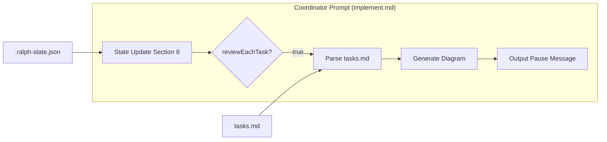

# Design: ASCII Art Per-Task Diagrams

## Overview

Add ASCII progress diagram to implement.md coordinator pause message (section 8, reviewEachTask=true branch). Diagram generated inline by parsing tasks.md for phase structure and task completion state. No external dependencies.

## Architecture



## Integration Point

**File**: `plugins/ralph-specum/commands/implement.md`
**Location**: Section 8 "State Update", lines 448-456 (reviewEachTask Pause Check)

**Current pause output** (6 lines):
```
TASK COMPLETE - PAUSED FOR REVIEW

Task $previousTaskIndex completed successfully.
Next task: $taskIndex of $totalTasks

Review the changes, then run /ralph-specum:implement to continue.
```

**Modified pause output** (adds diagram between task info and resume instructions).

## Diagram Format Specification

### Standard Format (multi-phase specs)

```
## Progress

Phase 1 (POC)          Phase 2 (Integration)
+----------------+     +--------------------+
| 1.1 Schema [x] |     | 2.1 spec-exec      | <-- NEXT
| 1.2 Questions  |     | 2.2 Layer 2        |
| 1.3 Storage    |     | 2.3 reviewTask     |
| 1.4 Config [x] |     | 2.4 autoPush       |
+----------------+     +--------------------+

Completed: 4/8 | Phase: Integration

Next: 2.1 Modify spec-executor for conditional commits
Files: spec-executor.md
```

### Layout Rules

| Rule | Value | Rationale |
|------|-------|-----------|
| Max width | 70 chars | Terminal readability |
| Phase columns | 2 visible | Current + next (collapse distant) |
| Task label | First 12 chars | Fit in column |
| Marker chars | `+`, `-`, `\|`, `[`, `]`, `x` | ASCII-only |
| NEXT indicator | `<-- NEXT` | Clear, unambiguous |
| Done indicator | `[x]` suffix | Matches tasks.md format |

### Phase Rendering Logic

```
1. Identify current phase (from taskIndex)
2. Show current phase + next phase (if exists)
3. Collapse previous phases to summary line
4. Each phase box: header + task list + footer
5. Mark completed tasks with [x]
6. Mark next task with <-- NEXT
```

## Technical Decisions

| Decision | Options | Choice | Rationale |
|----------|---------|--------|-----------|
| Diagram location | Before/after task info | After task info | Natural reading order: status, diagram, action |
| Phase columns | Horizontal vs vertical | Horizontal | Better use of terminal width, shows progression |
| Phase visibility | All phases vs current+next | Current+next | Avoids clutter for long specs |
| Task truncation | Wrap vs truncate | Truncate 12 chars | Consistent column width |
| Files section | From current/next task | Next task only | Focus on what's coming |
| External tools | figlet/boxes/graph-easy vs inline | Inline | Zero dependencies per NFR-3 |

## Coordinator Prompt Modifications

### Location

Section 8, **reviewEachTask Pause Check** block, step 2 "Output pause message"

### Prompt Addition

Add these instructions between steps 1 and 2:

```
**Generate Progress Diagram**:

Before outputting the pause message, generate an ASCII progress diagram:

1. Parse tasks.md to extract:
   - Phase headers (lines matching `## Phase N:`)
   - Tasks in each phase (lines matching `- [ ]` or `- [x]`)
   - Current task position (from taskIndex)

2. Determine visible phases:
   - Current phase (phase containing taskIndex)
   - Next phase (if current phase has remaining tasks after current, stay in current)
   - If current task is last in phase, show current + next phase

3. Render diagram following this template:
   ```
   ## Progress

   Phase N (Name)         Phase N+1 (Name)
   +----------------+     +----------------+
   | 1.1 Label [x]  |     | 2.1 Label      | <-- NEXT
   | 1.2 Label [x]  |     | 2.2 Label      |
   | 1.3 Label      |     | ...            |
   +----------------+     +----------------+

   Completed: X/Y | Phase: <current phase name>

   Next: <full next task description>
   Files: <files from next task Files section, comma-separated>
   ```

4. Constraints:
   - Max 70 chars wide
   - Truncate task labels to 12 chars with "..."
   - Show [x] for completed tasks
   - Show <-- NEXT on the next task line
   - If only one phase visible, center it
   - If phase has >6 tasks, show first 3 + "..." + last task
```

### Modified Pause Output Template

```
TASK COMPLETE - PAUSED FOR REVIEW

Task $previousTaskIndex completed successfully.
Next task: $taskIndex of $totalTasks

## Progress

<generated diagram here>

Review the changes, then run /ralph-specum:implement to continue.
```

## File Modification Plan

| File | Action | Section | Purpose |
|------|--------|---------|---------|
| `plugins/ralph-specum/commands/implement.md` | Modify | Section 8, lines 448-456 | Add diagram generation instructions |

Single file modification. No new files needed.

## Edge Case Handling

| Edge Case | Detection | Handling |
|-----------|-----------|----------|
| First task | taskIndex = 0 | Show "Starting spec" in summary, no previous phase |
| Last task of phase | Next task in different phase header | Show current + next phase columns |
| Last task of spec | taskIndex = totalTasks - 1 | Show "Final task!" in summary, no NEXT marker |
| Single-task phase | Phase has exactly 1 task | Render phase box with single task |
| Single-task spec | totalTasks = 1 | Simplified: "Single task spec - completing now" |
| Long task name | >12 chars | Truncate to 12 chars + "..." |
| Many tasks in phase | >6 tasks | Show first 3, "...", last task |
| Phase with [VERIFY] tasks | [VERIFY] marker in description | Include in diagram like normal task |

## Verification Strategy

### Manual Testing

1. **Create test spec with multi-phase tasks**:
   ```bash
   /ralph-specum:new test-ascii "Test ASCII diagrams"
   # Answer config questions with reviewEachTask=true
   # Create tasks with 2+ phases
   /ralph-specum:implement
   ```

2. **Verify diagram appears after each task pause**

3. **Test edge cases**:
   - Run spec with only 1 task
   - Run spec where next task is in new phase
   - Run spec with long task names (>12 chars)

### Grep Verification

```bash
# Verify diagram generation instructions added
grep -n "Progress Diagram" plugins/ralph-specum/commands/implement.md

# Verify template structure present
grep -n "Phase N" plugins/ralph-specum/commands/implement.md

# Verify edge case handling mentioned
grep -n "First task\|Last task\|Single-task" plugins/ralph-specum/commands/implement.md
```

### Acceptance Criteria Mapping

| AC | Verification |
|----|--------------|
| AC-1.1 | Diagram appears after "Task X completed" in pause output |
| AC-1.2 | Tasks marked [x] for completed |
| AC-1.3 | Current task unmarked, next has `<-- NEXT` |
| AC-1.4 | Diagram before "Review the changes..." |
| AC-2.1 | Phase header shown above each column |
| AC-2.2 | Tasks grouped under phase columns |
| AC-2.3 | [x] vs unmarked clearly visible |
| AC-2.4 | Works with all 4 phases (POC, Refactor, Testing, Quality) |
| AC-3.1 | Optional - not implementing completed task files |
| AC-3.2 | "Files:" line shows next task files |
| AC-3.3 | File list comma-separated, limited |
| AC-4.1 | First task shows "Starting spec" context |
| AC-4.2 | Last task of phase shows transition |
| AC-4.3 | Single-task phase renders correctly |
| AC-4.4 | Single-task spec shows simplified message |

## Implementation Steps

1. Open `plugins/ralph-specum/commands/implement.md`
2. Navigate to Section 8 "State Update", reviewEachTask block (lines 448-456)
3. Insert diagram generation instructions before step 2 "Output pause message"
4. Update pause message template to include `## Progress` section placeholder
5. Add edge case handling instructions for first/last/single task scenarios
6. Verify grep patterns match expected locations
7. Test with real spec (reviewEachTask=true)
