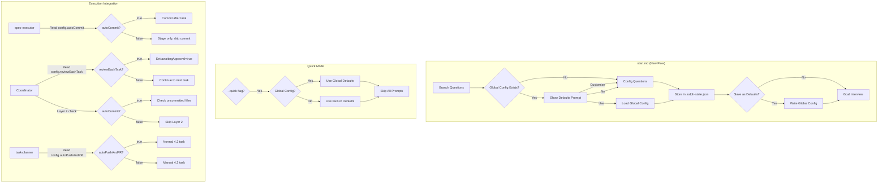
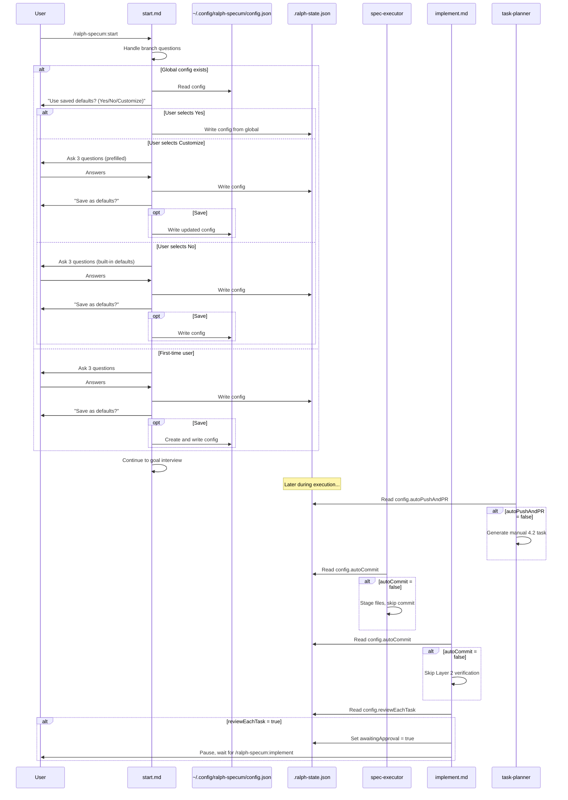

# Design: Config Questions

## Overview

Add config questions to `/ralph-specum:start` using existing AskUserQuestion pattern. Questions flow: check global config -> show defaults or ask questions -> store in per-spec state. Integration points: spec-executor (autoCommit), implement.md coordinator (reviewEachTask, Layer 2), task-planner (autoPushAndPR).

## Architecture



## Components

### Global Config Manager

**Purpose**: Read/write global config at `~/.config/ralph-specum/config.json`

**Operations**:
| Operation | Description |
|-----------|-------------|
| exists() | Check if global config file exists |
| read() | Read and parse global config JSON |
| write(config) | Create directory if needed, write config |

**File Format**:
```json
{
  "version": 1,
  "autoCommit": true,
  "reviewEachTask": false,
  "autoPushAndPR": true
}
```

### Config Question Flow (in start.md)

**Purpose**: Handle config question flow after branch questions, before goal interview

**Flow Logic**:
```
IF --quick flag:
  IF global config exists: use global defaults
  ELSE: use built-in defaults (true, false, true)
  SKIP all prompts
ELSE:
  IF global config exists:
    Show "Use saved defaults? (Yes/No/Customize)"
    IF Yes: load global, skip questions
    IF No: ask 3 questions, use built-in defaults
    IF Customize: ask 3 questions, prefill with global values
    After questions: "Save as new defaults?" prompt
  ELSE (first-time user):
    Ask 3 questions with built-in defaults
    After questions: "Save as defaults?" prompt
```

### Config Storage (per-spec)

**Location**: `./specs/<spec>/.ralph-state.json`

**Structure addition**:
```json
{
  "config": {
    "autoCommit": true,
    "reviewEachTask": false,
    "autoPushAndPR": true
  }
}
```

## Data Flow



## Technical Decisions

| Decision | Options Considered | Choice | Rationale |
|----------|-------------------|--------|-----------|
| Global config location | ~/.ralph-specum/, ~/.config/ralph-specum/ | ~/.config/ralph-specum/ | XDG Base Directory compliance, works on macOS/Linux |
| Config schema versioning | No version, version field | version: 1 | Enables future migrations |
| Question prompt style | Inline numbered, AskUserQuestion | AskUserQuestion | Consistency with goal interview pattern |
| Three-way defaults prompt | Binary (use/skip), Three-way | Three-way (Use/No/Customize) | Flexibility without overwhelming |
| Layer 2 when autoCommit=false | Require manual commit, skip check | Skip Layer 2 | Simpler UX, avoids blocking user |
| reviewEachTask with parallel | Pause per task, pause per batch | Pause per batch | Cleaner UX, batch is atomic unit |
| Default values | All true, mixed | autoCommit=true, reviewEachTask=false, autoPushAndPR=true | Matches current behavior (backward compat) |

## File Structure

| File | Action | Purpose |
|------|--------|---------|
| `plugins/ralph-specum/commands/start.md` | Modify | Add config question flow after branch questions |
| `plugins/ralph-specum/agents/spec-executor.md` | Modify | Check autoCommit before committing |
| `plugins/ralph-specum/commands/implement.md` | Modify | Layer 2 conditional, reviewEachTask pause |
| `plugins/ralph-specum/agents/task-planner.md` | Modify | Conditional 4.2 task based on autoPushAndPR |
| `plugins/ralph-specum/schemas/spec.schema.json` | Modify | Add config object to state schema |

## Integration Details

### start.md Changes

**Location**: After line 97 (branch questions), before line 528 (goal interview)

**New Section**: "Config Questions (Pre-Interview)"

```markdown
## Config Questions (Pre-Interview)

<mandatory>
**Skip config questions if --quick flag detected.**

If NOT quick mode, handle config questions after branch setup, before goal interview.
</mandatory>

### Quick Mode Config Handling

If `--quick` in $ARGUMENTS:
1. Check global config: `cat ~/.config/ralph-specum/config.json 2>/dev/null`
2. If exists and valid JSON: use global values
3. Else: use built-in defaults (autoCommit=true, reviewEachTask=false, autoPushAndPR=true)
4. Skip to goal interview (which is also skipped in quick mode)

### Global Config Check

```bash
if [ -f ~/.config/ralph-specum/config.json ]; then
  cat ~/.config/ralph-specum/config.json
fi
```

### If Global Config Exists

AskUserQuestion:
```
questions:
  - question: "Found saved config. Auto-commit: Yes, Review tasks: No, Auto PR: Yes. Use these?"
    options:
      - "Yes - use saved defaults"
      - "No - start fresh with standard defaults"
      - "Customize - adjust these settings"
```

Handle responses:
- "Yes": Read global config, write to state, skip config questions
- "No": Ask 3 config questions with built-in defaults
- "Customize": Ask 3 config questions prefilled with global values

### Config Questions (Standard)

AskUserQuestion:
```
questions:
  - question: "Should Ralph commit automatically after each task?"
    options:
      - "Yes (recommended)"
      - "No - I'll commit manually"
  - question: "Should Ralph pause for review after each task?"
    options:
      - "No (recommended) - continuous execution"
      - "Yes - pause for my review"
  - question: "Should Ralph push and create PR when complete?"
    options:
      - "Yes (recommended)"
      - "No - I'll handle git remote"
```

### Save Defaults Prompt

After config questions answered (not "Use saved defaults"):
```
AskUserQuestion:
  questions:
    - question: "Save these settings as your defaults for future specs?"
      options:
        - "Yes"
        - "No"
```

If Yes:
```bash
mkdir -p ~/.config/ralph-specum
cat > ~/.config/ralph-specum/config.json << 'EOF'
{
  "version": 1,
  "autoCommit": $autoCommit,
  "reviewEachTask": $reviewEachTask,
  "autoPushAndPR": $autoPushAndPR
}
EOF
```

### Store Config in State

Write to .ralph-state.json config object:
```json
{
  "config": {
    "autoCommit": <boolean>,
    "reviewEachTask": <boolean>,
    "autoPushAndPR": <boolean>
  }
}
```

### Update .progress.md Configuration Section

Write after Goal section:
```markdown
## Configuration

- Auto-commit: Yes/No
- Review each task: Yes/No
- Auto push and PR: Yes/No
```
```

### spec-executor.md Changes

**Location**: Section "Commit Discipline" (lines 266-289)

**Change**: Add conditional commit based on autoCommit config

```markdown
## Commit Discipline

<mandatory>
ALWAYS stage spec files. Commit ONLY if autoCommit enabled.
</mandatory>

Before committing, read config from state:
```bash
autoCommit=$(jq -r '.config.autoCommit // true' ./specs/<spec>/.ralph-state.json)
```

- If autoCommit=true (or missing - backward compat): commit as usual
- If autoCommit=false:
  1. Stage files: `git add <files>`
  2. Skip commit
  3. Log in .progress.md: "Changes staged (autoCommit disabled)"
  4. Proceed to TASK_COMPLETE

**Critical**: Even with autoCommit=false, still output TASK_COMPLETE after staging. The coordinator will skip Layer 2 verification.
```

### implement.md Coordinator Changes

**Location 1**: Section 7 "Verification Layers", Layer 2

**Change**: Skip Layer 2 when autoCommit=false

```markdown
**Layer 2: Uncommitted Spec Files Check**

First, check autoCommit config:
```bash
autoCommit=$(jq -r '.config.autoCommit // true' ./specs/$spec/.ralph-state.json)
```

**If autoCommit=false**: Skip Layer 2 entirely. Proceed to Layer 3.

**If autoCommit=true (or missing)**:
[existing Layer 2 logic]
```

**Location 2**: Section 8 "State Update"

**Change**: Check reviewEachTask after task completion

```markdown
### 8. State Update

After successful completion:

[existing sequential/parallel update logic]

**Check reviewEachTask:**
```bash
reviewEachTask=$(jq -r '.config.reviewEachTask // false' ./specs/$spec/.ralph-state.json)
```

If reviewEachTask=true AND taskIndex < totalTasks:
1. Set awaitingApproval=true in state file
2. Output: "Task complete. Run /ralph-specum:implement to continue."
3. STOP - do not continue to next task

If reviewEachTask=false (or missing):
- Continue to next iteration (loop re-invokes coordinator)

Check if all tasks complete:
[existing completion logic]
```

### task-planner.md Changes

**Location**: Section "Phase 4: Quality Gates", task 4.2 (lines 378-395)

**Change**: Conditional 4.2 task generation

```markdown
### Phase 4 Task 4.2 Generation

Read autoPushAndPR from .progress.md Configuration section or pass via delegation context.

**If autoPushAndPR=true (default):**
```markdown
- [ ] 4.2 Create PR and verify CI
  - **Do**:
    1. Push branch: `git push -u origin <branch-name>`
    2. Create PR: `gh pr create --title "<title>" --body "<summary>"`
  - **Verify**: `gh pr checks` shows all green
  - **Done when**: CI passes, PR ready for review
```

**If autoPushAndPR=false:**
```markdown
- [ ] 4.2 Manual: Push and create PR
  - **Do**:
    1. Log message: "autoPushAndPR disabled. Push and create PR manually when ready."
    2. Output branch name and suggested PR title
  - **Verify**: true (always passes - manual step)
  - **Done when**: User notified of manual steps required
  - **Commit**: None
```
```

## Error Handling

| Error Scenario | Handling Strategy | User Impact |
|----------------|-------------------|-------------|
| Global config file corrupt/invalid JSON | Log warning, treat as no global config | User asked config questions as first-time |
| ~/.config directory not writable | Log warning, skip save | User config not persisted, per-spec still works |
| Missing config in state (old spec) | Use defaults (true, false, true) | Backward compatible behavior |
| Layer 2 fails with autoCommit=false | Skip Layer 2 check | No false failures |
| reviewEachTask pause interrupted | State preserved, resume on next /implement | User can continue anytime |

## Edge Cases

- **Existing specs without config**: Default values applied (backward compat)
- **Global config created mid-session**: Only affects new specs, current spec uses stored config
- **autoCommit=false + reviewEachTask=true**: Both respected - stages files, pauses for review
- **Parallel batch + reviewEachTask=true**: Pause after entire batch, not per-task
- **autoPushAndPR=false + Phase 4**: Manual task created, spec still completes normally
- **Quick mode with global config**: Silent use of global defaults, no prompts
- **Quick mode without global config**: Silent use of built-in defaults

## Test Strategy

### Unit Tests
N/A - Plugin is pure markdown, no test infrastructure

### Integration Tests
Manual verification of config flows:

| Test Case | Steps | Expected |
|-----------|-------|----------|
| First-time user | Run /start on fresh system | 3 config questions asked |
| Returning user - Use | Run /start with global config | "Use saved?" prompt, select Yes |
| Returning user - Customize | Select Customize | Questions shown with saved values |
| Quick mode - global | Run /start --quick with global | No prompts, global values used |
| Quick mode - no global | Run /start --quick, fresh system | No prompts, built-in defaults |
| autoCommit=false | Set config, run task | Files staged, no commit |
| reviewEachTask=true | Set config, run task | Pauses after task completion |
| autoPushAndPR=false | Set config, generate tasks | Manual 4.2 task generated |
| Backward compat | Resume old spec without config | Works with defaults |

### E2E Tests
N/A - Manual execution of full spec workflow

## Performance Considerations

- Single file read for global config check
- Config questions use single AskUserQuestion call (3 questions bundled)
- No additional file I/O during task execution beyond existing state reads

## Security Considerations

- Global config in user home directory (standard XDG location)
- No sensitive data in config (only boolean preferences)
- File permissions follow system defaults

## Existing Patterns to Follow

Based on codebase analysis:
- **AskUserQuestion pattern**: Match goal interview structure in start.md (lines 544-565)
- **State file updates**: Use jq for JSON manipulation (established pattern)
- **Quick mode checks**: Check `--quick` in $ARGUMENTS before prompts
- **Config object in state**: Already exists (lines 13-17 in current .ralph-state.json)
- **Backward compatibility**: Always provide defaults when config missing

## Unresolved Questions

1. ~~Layer 2 conflict~~ - Resolved: skip Layer 2 when autoCommit=false
2. ~~Parallel batch pause~~ - Resolved: pause after entire batch
3. **Schema update**: Should spec.schema.json be updated to include config object? Recommend: yes, for validation

## Implementation Steps

1. Add config object to spec.schema.json
2. Add config question section to start.md (after branch, before goal interview)
3. Add global config read/write logic to start.md
4. Add save defaults prompt to start.md
5. Modify spec-executor.md commit discipline section
6. Modify implement.md Layer 2 to check autoCommit
7. Modify implement.md State Update to check reviewEachTask
8. Modify task-planner.md Phase 4 task 4.2 generation
9. Update .progress.md Configuration section in start.md
